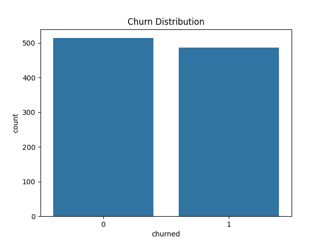
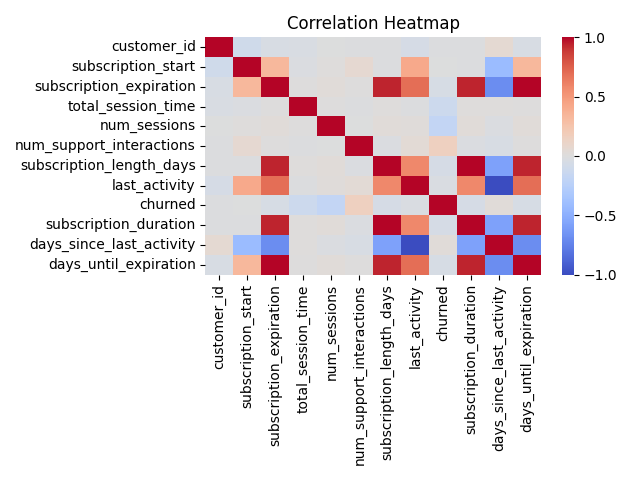
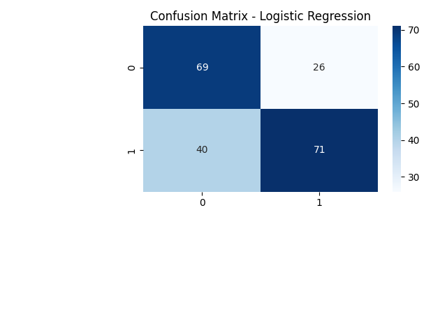
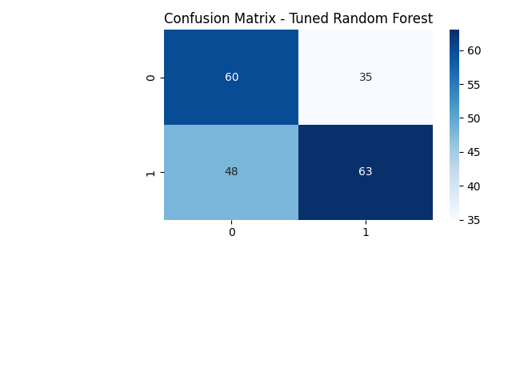
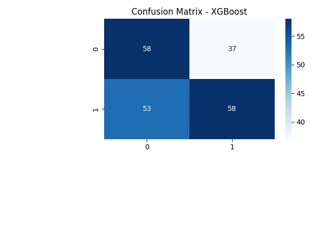

# Predict Churn

Example Python code for predicting customer churn for a subscription service.

Churn is binary (churned vs. not churned). It means no renewal within 30 days of
subscription expiration.

Data available includes subscription history, customer demographics, usage
patterns, and support interactions. The dataset is explored using visualization
tools like Seaborn and Matplotlib to identify trends and correlations.

Meaningful features like average session duration, frequency of interactions,
and changes in usage over time are engineered. Time-based features, such as the
recency of activity, play a significant role.

After splitting the data into training and testing sets, the code experiments
with models like Logistic Regression, Random Forests, and XGBoost.
Hyperparameters are fine-tued using GridSearchCV and Bayesian optimization.

The focus is on the precision, recall, and F1 score metrics. SMOTE helps balance
the dataset.

## Installation

You must have git and Python installed.

Clone this repository.

```sh
git clone https://github.com/travishorn/predict_churn
```

Change into the directory.

```sh
cd predict_churn
```

Install the dependencies.

```sh
pip install -r requirements.txt
```

## Usage

Look at `dataset.csv` to get an idea of what the data looks li.e

Run the script.

```sh
python main.py
```

Output is printed to the terminal.

Visualization images are also saved in the `output` directory.

## Interpreting Results



The number of customers who have not churned (0) is slightly higher than the
number of those who have churned (1). There are more customers who have stayed
with the company compared to those who have left.

This chart shows the balance of the dataset. The dataset is balanced (i.e.,
roughly the same number of customers in both categories). This ensures accurate
predictions.



The color scale from blue to red indicates the strength and direction of
correlation. Positive correlations are shown in shades of red, while negative
correlations are shown in shades of blue. The intensity of the color represents
the magnitude of the correlation.

Some variables have strong positive or negative correlations with each other.
`total_session_time` is strongly correlated with `num_sessions`, as one would
expect that more sessions result in more total session time.

`churned` shows interesting correlations with other variables. Look at these
correlations to determine which features can best help predict churn.
`total_session_time` and `days_since_last_activity` have negative correlation.
The more a customer uses the service and the more recently, the less likely they
are to churn. `num_support_interactions` has positive correlation. The more
support interactions, the more likely the customer is to churn.

Some variable pairs are highly correlated (close to 1 or -1), and might be
redundant. For example, `subscription_length_days` and `subscription_duration`
are very similar.



The logistic regression model correctly predicts non-churned customers quite well (69 true negatives). It also accurately identifies churned customers (71 true positives). There are a notable number of customers incorrectly predicted to churn, which might affect customer relations if acted upon (26 false positives). There are also a notable number of churned customers, meaning possible lost opportunity to retain them with interventions (40 false negatives).

```
--- Logistic Regression ---
              precision    recall  f1-score   support

           0       0.63      0.73      0.68        95
           1       0.73      0.64      0.68       111

    accuracy                           0.68       206
   macro avg       0.68      0.68      0.68       206
weighted avg       0.69      0.68      0.68       206
```

Precision: 63% of the predicted non-churned customers are correctly identified. 73% of the predicted churned customers are correctly identified.

Recall: 73% of the actual non-churned customers are correctly identified. 64% of the actual non-churned customers are correctly identified.

F1 score: The harmonic mean between precision and recall. 68% indicates a balance between the two.

Overall, the model correctly predicts the churn status for 68% of all customers in the dataset (accuracy).

In addition to Logistic Regression, this same confusion matrix and model evaluation is done for Random Forest, Tuned Random Forest, and XGBoost.


```
--- Random Forest ---
              precision    recall  f1-score   support

           0       0.56      0.63      0.59        95
           1       0.65      0.58      0.61       111

    accuracy                           0.60       206
   macro avg       0.60      0.60      0.60       206
weighted avg       0.61      0.60      0.60       206
```



```
--- Tuned Random Forest ---
              precision    recall  f1-score   support

           0       0.56      0.63      0.59        95
           1       0.64      0.57      0.60       111

    accuracy                           0.60       206
   macro avg       0.60      0.60      0.60       206
weighted avg       0.60      0.60      0.60       206
```



```
--- XGBoost ---
              precision    recall  f1-score   support

           0       0.52      0.61      0.56        95
           1       0.61      0.52      0.56       111

    accuracy                           0.56       206
   macro avg       0.57      0.57      0.56       206
weighted avg       0.57      0.56      0.56       206
```

## License

The MIT License

Copyright 2024 Travis Horn

Permission is hereby granted, free of charge, to any person obtaining a copy of
this software and associated documentation files (the “Software”), to deal in
the Software without restriction, including without limitation the rights to
use, copy, modify, merge, publish, distribute, sublicense, and/or sell copies of
the Software, and to permit persons to whom the Software is furnished to do so,
subject to the following conditions:

The above copyright notice and this permission notice shall be included in all
copies or substantial portions of the Software.

THE SOFTWARE IS PROVIDED “AS IS”, WITHOUT WARRANTY OF ANY KIND, EXPRESS OR
IMPLIED, INCLUDING BUT NOT LIMITED TO THE WARRANTIES OF MERCHANTABILITY, FITNESS
FOR A PARTICULAR PURPOSE AND NONINFRINGEMENT. IN NO EVENT SHALL THE AUTHORS OR
COPYRIGHT HOLDERS BE LIABLE FOR ANY CLAIM, DAMAGES OR OTHER LIABILITY, WHETHER
IN AN ACTION OF CONTRACT, TORT OR OTHERWISE, ARISING FROM, OUT OF OR IN
CONNECTION WITH THE SOFTWARE OR THE USE OR OTHER DEALINGS IN THE SOFTWARE.
